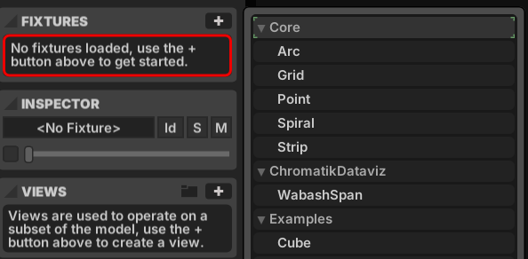

# Chromatik DataViz Instructions for DePaul University School of Design

## Setup
0. Install the latest version of Chromatik from https://chromatik.co/download
1. Follow the instructions in the [README](README.md) to install the dataviz plugin.
2. Create a new project. Add a `WabashSpan` fixture to your project.
 
2. For video support, install the ChromatikGST plugin at https://github.com/tracyscott/chromatikgst
3. ChromatikGST includes an example Java Processing Sketch for rendering a 4x468 video that can be played on the Wabash fixture.  It relies on ffmpeg being installed and available in your path to generate the lossless video from a series of saved frames.  
https://github.com/tracyscott/ChromatikGST/blob/main/Processing/ChromatikGSTVideo/ChromatikGSTVideo.pde
4. Read the Chromatik User Guide for information on using Chromatik.  https://chromatik.co/guide/
5. Join the Chromatik Discord server for support.  https://discord.gg/JmUkbNGtve

