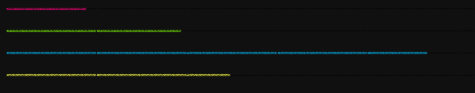
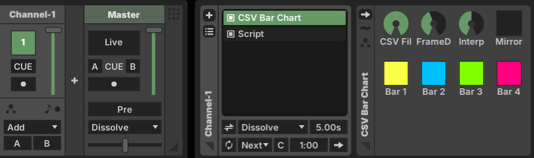
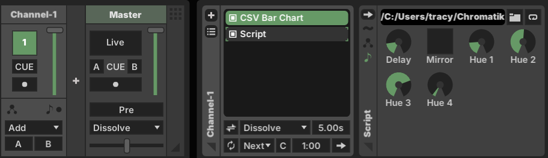

# Chromatik DataViz

A minimal package for rendering animated bar charts in Chromatik.

## Features

- Render 4 animated bar charts in parallel
- Both Java and Javascript versions
- Java version supports background reloading of csv data

## Installation

* Download the latest `chromatik-dataviz.jar` release from the [releases page](https://github.com/tracyscott/chromatikdataviz/releases).
* Drag and drop the downloaded JAR file into your Chromatik project.

## Usage
* Add a `CsvBarChartPattern` to a channel.
 

* `CsvBarChartPattern` will scan the `~/Chromatik/dataviz` folder for csv files and make them selectable with the CSV File knob.
* The default implementation assumes that there are 4 strands of LEDs to render on.  For testing, you can add a `WabashSpan` fixture to your project.
 

* As part of instantiating the pattern for the first time, the plugin will create a new folder called `dataviz` in your `~/Chromatik` folder. Inside will be test csv files, a utility javascript file (`cvs.js`) and a simple javascript bar chart pattern (`barchart.js`) that uses the `cvs.js` utility to load the csv files.

* After the `dataviz` folder is created, you can add a `Script` pattern to your project and select `~/Chromatik/dataviz/barchart.js`as the javascript pattern.


## Javascript Pattern example

Below is an example of a Chromatik pattern that renders 4 animated bar charts.  You can add a custom javascript pattern to your project without the need to build any plugin packages.  I have included a utility cvs.js file for loading csv data and a simple render_bar_chart function.
```javascript
include("csv.js")

knob("delay", "Delay", "Delay between bars", 0);
toggle("mirror", "Mirror", "Mirror the bars", false);
knob("hue1", "Hue 1", "Hue 1", 0);
knob("hue2", "Hue 2", "Hue 2", 0);
knob("hue3", "Hue 3", "Hue 3", 0);
knob("hue4", "Hue 4", "Hue 4", 0);

var table;
var timeSinceLastFrame = 0;
var frameNumber = 0;

var init = function(model) {
  table = loadCSVAsTable("C:\\Users\\tracy\\Chromatik\\dataviz\\test1.csv", ",");
};

var run = function(deltaMs, nowMillis, model, colors, enabledAmount) {
  var color1 = hsb(hue1 * 360, 100, 100);
  var color2 = hsb(hue2 * 360, 100, 100);
  var color3 = hsb(hue3 * 360, 100, 100);
  var color4 = hsb(hue4 * 360, 100, 100);
  render_bar_chart(colors, 4, 0, table[frameNumber][0], color1, mirror); 
  render_bar_chart(colors, 4, 1, table[frameNumber][1], color2, mirror); 
  render_bar_chart(colors, 4, 2, table[frameNumber][2], color3, mirror); 
  render_bar_chart(colors, 4, 3, table[frameNumber][3], color4 , mirror); 
  timeSinceLastFrame += deltaMs;
  if (timeSinceLastFrame >= delay*10000) {
    frameNumber++;
    timeSinceLastFrame = 0;
  }
  if (frameNumber >= table.length) {
    frameNumber = 0;
  }
}

```


## License

MIT License - see the [LICENSE](LICENSE) file for details.
